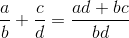

## Krok 3. Operacje arytmetyczne

W kroku tym zdefiniujesz podstawowe działania arytmetyczne i operacje matematyczne na ułamkach.

Kod z tego etapu prawdopodobnie zrefaktoryzujesz po zrealizowaniu etapu związanego z konwersjami.

Wykonuj zadania w podanej kolejności.

### Zadania do wykonania

1. W projekcie _Class library_ dodaj nową klasę. Plik nazwij `UlamekArithmetic.cs`. 

2. Zmień nazwę klasy na `Ulamek`. Dodaj słowo kluczowe `partial` przed `class`. Korzystasz z funkcjonalności dzielenia klasy na wiele plików [`partial class`](https://docs.microsoft.com/en-us/dotnet/csharp/programming-guide/classes-and-structs/partial-classes-and-methods). Rozbudowę klasy `Ulamek` w zakresie tego kroku przeprowadzisz w tym pliku.

3. W projekcie z testami jednostkowymi utwórz plik o nazwie `UnitTestUlamekArithmetic.cs`. Możesz to wykonać kolejno poleceniami: *Add > New Item .. > Basic Unit Test*. testy jednostkowe związane z implementacją równości ułamków zapisz w tym pliku.

4. Utwórz publiczną metodę o sygnaturze
    ```csharp
    public Ulamek Plus(Ulamek inny)
    ```
    realizującą operację dodawania ułamków.

    Próba dodania `null` skutkuje zgłoszeniem wyjątku `ArgumentException`.

5. Utwórz publiczną statyczną metodę o sygnaturze
    ```csharp
    public static Ulamek Suma(Ulamek u1, Ulamek u2)
    ```
    realizującą operację obliczania sumy dwóch ułamków.

    Próba sumowania `null` skutkuje zgłoszeniem wyjątku `ArgumentException`.

6. Zmodyfikuj metodę `Suma` tak, aby mogła przyjąć wiele argumentów (ale co najmniej 2).

7. Zdefiniuj przeciążenie operatora `+`.

8. Zrób to samo dla pozostałych operatorów arytmetycznych dwuargumentowych (`-`, `*`, `/`) oraz jednoargumentowego `-` (znak przeciwny), inkrementacji (`++`) i dekrementacji (`--`).

9. Zaimplementuj dla ułamka wybrane metody z [`System.Math`]((https://docs.microsoft.com/en-us/dotnet/api/system.math?view=netframework-4.7.2)):
    * `Abs`
    * `Sign`
    * `Floor`
    * `Ceiling`
    * `Max`
    * `Pow`

10. Oczywiście opracuj stosowne testy jednostkowe dla tych nowych funkcjonalności.

### Podpowiedzi

1. W języku Java nie ma możliwości przeciążania operatorów. Zatem opracowując klasę `Ulamek` w tym języku, operacje arytmetyczne definiowałbyś tak, jak w zadaniu `Plus` i `Suma`. Później budowałbyś wyrażenia arytmetyczne dla ułamków w trochę nieintuicyjny sposób:

   ```java
   Ulamek u = ((new Ulamek(1,2)).Plus(new Ulamek(1,3))).Razy(new Ulamek(2,3)); // (1/2 + 1/3) * 2/3
   ```

    W C# oraz C++ przeciążanie operatorów zwieksza czytelność i zmniejsza ilość kodu, natomiast błędnie (niedokładnie) wykonane powoduje pojawienie się błędów trudne do zidentyfikowania (należy zwrócić szczególną uwagę na konstruktory oraz na konwersje w powiązaniu z operacjami arytmetycznymi).

2. Aby przekazać do metody wiele argumentów użyj słowa kluczowego [params](https://docs.microsoft.com/en-us/dotnet/csharp/language-reference/keywords/params).

3. Przeczytaj [dokumentację](https://docs.microsoft.com/en-US/dotnet/csharp/programming-guide/statements-expressions-operators/overloadable-operators) na temat przeciążania operatorów.

4. Jak opracować testy jednostkowe dla dodawania? Musisz zweryfikować prawa dodawania dla liczb wymiernych (formalnie zbiór liczb wymiernych z operacją `+` jest [grupą przemienną](https://pl.wikipedia.org/wiki/Grupa_przemienna)). Zatem:
   * poprawność dodawania ułamków: ( \( \frac{a}{b} + \frac{c}{d} = \frac{ad+bc}{bd} \) ) 
   * `ZERO` jest elementem neutralnym: `u + 0 == 0 + u == u`
   * dodawanie jest operacją przemienną: `u + v == v + u`
   * dodawanie jest operacją łączną: `u + (v + w) == (u + v) + w`
   * dla dowolnego niezerowego elementu `u` istnieje element przeciwny `-u`, tj. taki, że `u + (-u) == (-u) + u == 0`
   * z poprzedniego punktu wynika, że odejmowanie jest operacją przeciwną do dodawania.

5. Jak opracować testy jednostkowe dla mnożenia? Analogicznie, weryfikujesz prawa matematyczne:
   * poprawność mnożenia ( \( \frac{a}{b} \cdot \frac{c}{d} = \frac{ac}{bd} \) )
   * `JEDEN` jest elementem neutralnym  `u * 1 == 1 * u == u`
   * mnożenie jest przemienne: `u * v == v * u`
   * dla dowolnego niezerowego elementu `u` istnieje element odwrotny `v`, tj. taki, że `u * v == v * u == 1`. Element ten nazywany jest _odwrotnością_
   * z poprzedniego punktu wynika, że dzielenie jest operacją odwrotną do mnożenia.

6. Formalnie, aby dostarczyć (na tym etapie) pełnego wsparcia dla działań arytmetycznych na ułamkach, musisz wielokrotnie przeciążyć operatory arytmetyczne. W końcu ułamki są liczbami i mają "współgrać" z innymi typami liczbowymi. Zatem, przykładowo, musisz rozważyć następujące przeciążenia metody `Plus()` oraz operatora `+`:

    ```csharp
    Ulamek Plus(Ulamek u);
    Ulamek Plus(int x);
    Ulamek Plus(long y);
    //...
    Ulamek Plus(float f);
    Ulamek Plus(double d);
    //... i.t.d. dla wszystkich typów liczbowych

    Ulamek operator+(Ulamek u, Ulamek v);
    Ulamek operator+(int x, Ulamek u);
    Ulamek operator+(Ulamek u, int x);
    //... i.t.d. dla wszystkich typów liczbowych
    ```

    * Jednak niekoniecznie wszystkie. Jeśli np. zrealizujesz przeciążenie `Ulamek Plus(long)`, to nie musisz realizować `Ulamek Plus(int)`. W przypadku podania argumentu typu `int` nastąpi automatyczna jego konwersja do `long` i wywołana zostanie pasująca metoda `Ulamek Plus(long)`. Podobnie będzie z `float` i `double` oraz z przeciążeniami operatora `+`.

    * Jeśli w projekcie poprawnie zdefiniujesz konwersje (jawne i domyślne), nie będziesz się musiał przejmować tymi przeciążeniami.

[Początek](README.md) | [Krok poprzedni](step02.md) | [Krok następny](step04.md)